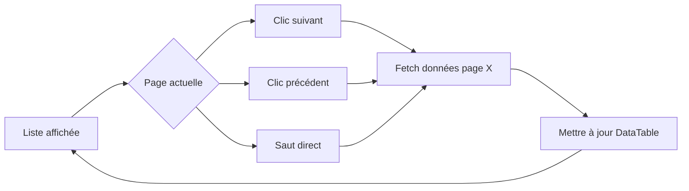
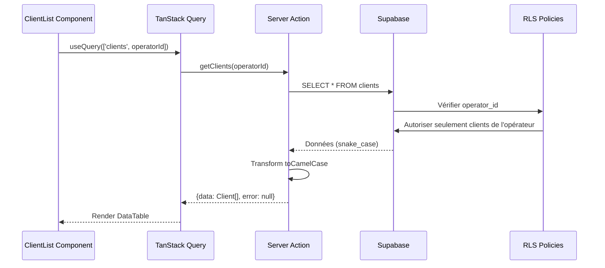

# Flux — Module CRM

## Flux principal : MiKL recherche un client


## Flux secondaire : Pagination



## Flux technique : Data fetching



## Flux : Création d'un client

```mermaid
flowchart TD
    Start([MiKL clique "Créer un client"]) --> OpenDialog[Ouvrir dialog modal]
    OpenDialog --> FillForm[Remplir formulaire]
    FillForm --> Submit[Cliquer "Créer"]

    Submit --> ClientValidation{Validation client Zod ?}
    ClientValidation -->|Erreurs| ShowErrors[Afficher erreurs inline]
    ShowErrors --> FillForm

    ClientValidation -->|OK| ServerAction[Server Action createClient]
    ServerAction --> ServerValidation{Validation serveur ?}
    ServerValidation -->|Erreurs| ReturnError[Retourner { data: null, error }]

    ServerAction --> CheckEmail{Email unique ?}
    CheckEmail -->|Déjà utilisé| EmailError[Erreur EMAIL_ALREADY_EXISTS]
    EmailError --> ShowEmailError[Afficher erreur champ email]
    ShowEmailError --> FillForm

    CheckEmail -->|Unique| InsertDB[INSERT clients + client_configs]
    InsertDB --> CheckInsert{Insertion OK ?}
    CheckInsert -->|Erreur| DBError[Toast erreur DB]
    DBError --> FillForm

    CheckInsert -->|OK| InvalidateCache[Invalider cache TanStack Query]
    InvalidateCache --> Toast[Toast "Client créé avec succès"]
    Toast --> CloseDialog[Fermer dialog]
    CloseDialog --> Navigate[Router.push vers fiche client]
    Navigate --> End([Fin])
```

## Flux : Édition d'un client

```mermaid
flowchart TD
    Start([MiKL clique "Modifier"]) --> OpenDialog[Ouvrir dialog édition]
    OpenDialog --> PreFill[Pré-remplir formulaire avec données existantes]
    PreFill --> EditForm[Modifier champs]
    EditForm --> Submit[Cliquer "Enregistrer"]

    Submit --> Validation{Validation Zod ?}
    Validation -->|Erreurs| ShowErrors[Afficher erreurs inline]
    ShowErrors --> EditForm

    Validation -->|OK| ServerAction[Server Action updateClient]
    ServerAction --> CheckEmail{Email modifié et unique ?}
    CheckEmail -->|Déjà utilisé| EmailError[Erreur email]
    EmailError --> EditForm

    CheckEmail -->|OK ou non modifié| UpdateDB[UPDATE clients]
    UpdateDB --> InvalidateCache[Invalider cache liste + fiche]
    InvalidateCache --> Toast[Toast "Client mis à jour"]
    Toast --> CloseDialog[Fermer dialog]
    CloseDialog --> End([Fin])
```

## Notes

- La recherche utilise un debounce de 300ms pour éviter les requêtes excessives
- Le seuil de 500 clients détermine si le filtrage est client-side ou server-side
- RLS garantit l'isolation des données même si le front-end est compromis
- TanStack Query met en cache les résultats pour améliorer les performances
