# Flux — Module CRM

## Flux principal : MiKL recherche un client

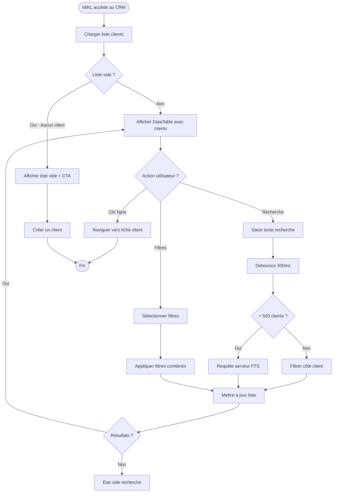

## Flux secondaire : Pagination

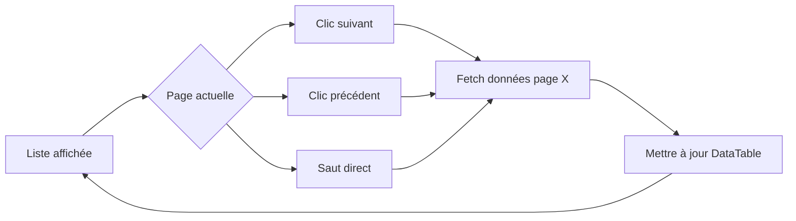

## Flux technique : Data fetching

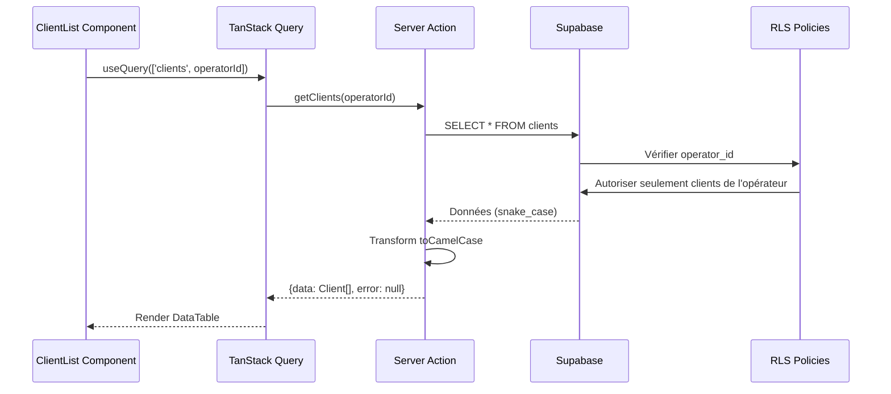

## Flux : Création d'un client

```mermaid
flowchart TD
    Start([MiKL clique "Créer un client"]) --> OpenDialog[Ouvrir dialog modal]
    OpenDialog --> FillForm[Remplir formulaire]
    FillForm --> Submit[Cliquer "Créer"]

    Submit --> ClientValidation{Validation client Zod ?}
    ClientValidation -->|Erreurs| ShowErrors[Afficher erreurs inline]
    ShowErrors --> FillForm

    ClientValidation -->|OK| ServerAction[Server Action createClient]
    ServerAction --> ServerValidation{Validation serveur ?}
    ServerValidation -->|Erreurs| ReturnError[Retourner { data: null, error }]

    ServerAction --> CheckEmail{Email unique ?}
    CheckEmail -->|Déjà utilisé| EmailError[Erreur EMAIL_ALREADY_EXISTS]
    EmailError --> ShowEmailError[Afficher erreur champ email]
    ShowEmailError --> FillForm

    CheckEmail -->|Unique| InsertDB[INSERT clients + client_configs]
    InsertDB --> CheckInsert{Insertion OK ?}
    CheckInsert -->|Erreur| DBError[Toast erreur DB]
    DBError --> FillForm

    CheckInsert -->|OK| InvalidateCache[Invalider cache TanStack Query]
    InvalidateCache --> Toast[Toast "Client créé avec succès"]
    Toast --> CloseDialog[Fermer dialog]
    CloseDialog --> Navigate[Router.push vers fiche client]
    Navigate --> End([Fin])
```

## Flux : Édition d'un client

```mermaid
flowchart TD
    Start([MiKL clique "Modifier"]) --> OpenDialog[Ouvrir dialog édition]
    OpenDialog --> PreFill[Pré-remplir formulaire avec données existantes]
    PreFill --> EditForm[Modifier champs]
    EditForm --> Submit[Cliquer "Enregistrer"]

    Submit --> Validation{Validation Zod ?}
    Validation -->|Erreurs| ShowErrors[Afficher erreurs inline]
    ShowErrors --> EditForm

    Validation -->|OK| ServerAction[Server Action updateClient]
    ServerAction --> CheckEmail{Email modifié et unique ?}
    CheckEmail -->|Déjà utilisé| EmailError[Erreur email]
    EmailError --> EditForm

    CheckEmail -->|OK ou non modifié| UpdateDB[UPDATE clients]
    UpdateDB --> InvalidateCache[Invalider cache liste + fiche]
    InvalidateCache --> Toast[Toast "Client mis à jour"]
    Toast --> CloseDialog[Fermer dialog]
    CloseDialog --> End([Fin])
```

## Flux : Navigation fiche client multi-onglets

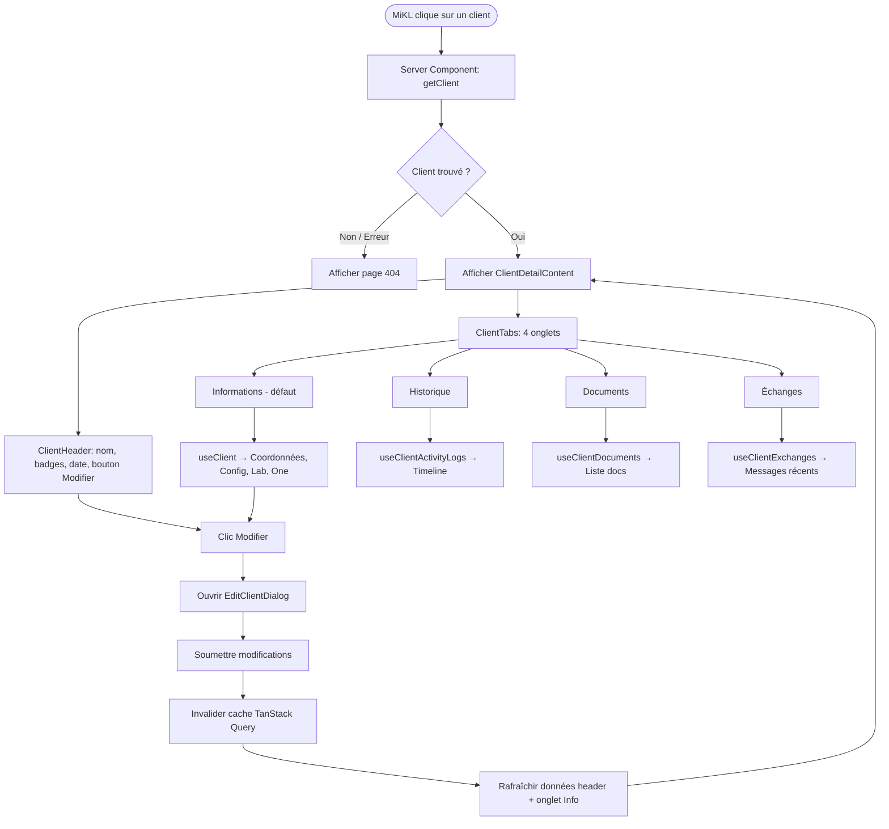

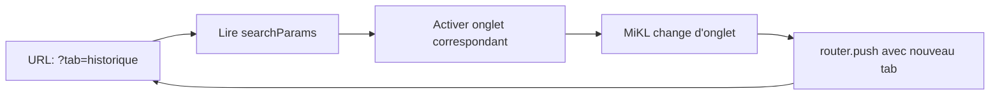

## Flux : Assignation parcours Lab

```mermaid
flowchart TD
    Start([MiKL clique "Assigner un parcours Lab"]) --> OpenDialog[Ouvrir AssignParcoursDialog]
    OpenDialog --> LoadTemplates[useParcoursTemplates]

    LoadTemplates --> CheckTemplates{Templates disponibles ?}
    CheckTemplates -->|Non| EmptyState[Afficher état vide + mention Epic 12]
    CheckTemplates -->|Oui| ShowTemplates[Lister templates]

    ShowTemplates --> SelectTemplate[MiKL sélectionne un template]
    SelectTemplate --> ShowStages[Afficher étapes avec toggles]
    ShowStages --> ConfigStages[MiKL active/désactive étapes]
    ConfigStages --> ClickAssign[Cliquer "Assigner"]

    ClickAssign --> ServerAction[Server Action assignParcours]
    ServerAction --> InsertParcours[INSERT parcours]
    InsertParcours --> UpdateConfig[UPDATE client_configs dashboard_type=lab]
    UpdateConfig --> LogActivity[INSERT activity_logs]
    LogActivity --> InvalidateCache[Invalider caches TanStack Query]
    InvalidateCache --> Toast[Toast "Parcours Lab assigné avec succès"]
    Toast --> CloseDialog[Fermer dialog]
    CloseDialog --> End([Fin])
```

## Flux : Toggle accès Lab/One

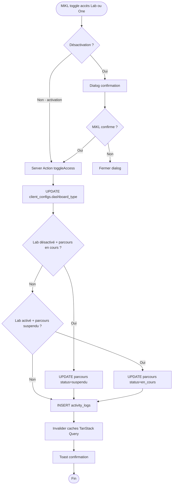

## Flux : CRUD Notes privées

```mermaid
flowchart TD
    Start([MiKL ouvre fiche client, onglet Infos]) --> ShowNotes[ClientNotesSection affichée]
    ShowNotes --> LoadNotes[useClientNotes → getClientNotes]
    LoadNotes --> HasNotes{Notes existantes ?}

    HasNotes -->|Non| EmptyMsg[Afficher "Aucune note privée"]
    HasNotes -->|Oui| NotesList[Liste notes DESC par date]

    ShowNotes --> AddAction[MiKL saisit texte + clique "Ajouter"]
    AddAction --> CreateNote[Server Action createClientNote]
    CreateNote --> InvalidateNotes[Invalider cache client-notes]
    InvalidateNotes --> Toast1[Toast "Note ajoutée"]
    Toast1 --> LoadNotes

    NotesList --> EditAction[MiKL clique Modifier sur une note]
    EditAction --> InlineEdit[Textarea inline + Sauvegarder/Annuler]
    InlineEdit --> UpdateNote[Server Action updateClientNote]
    UpdateNote --> InvalidateNotes

    NotesList --> DeleteAction[MiKL clique Supprimer sur une note]
    DeleteAction --> ConfirmDialog[AlertDialog confirmation]
    ConfirmDialog --> UserConfirm{Confirme ?}
    UserConfirm -->|Non| NotesList
    UserConfirm -->|Oui| DeleteNote[Server Action deleteClientNote]
    DeleteNote --> InvalidateNotes
```

## Flux : Épingler / Désépingler un client

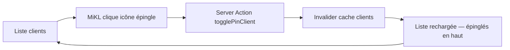

## Flux : Reporter un client ("À traiter plus tard")

```mermaid
flowchart TD
    Start([MiKL clique "À traiter plus tard"]) --> OpenDialog[Ouvrir DeferDialog]
    OpenDialog --> SetDate[Choisir date de rappel]
    SetDate --> ClickValider[Cliquer "Valider"]

    ClickValider --> DeferAction[Server Action deferClient]
    DeferAction --> InvalidateClients[Invalider cache clients]
    InvalidateClients --> Toast[Toast "Client reporté"]
    Toast --> CloseDialog[Fermer dialog]

    OpenDialog --> HasExisting{Report existant ?}
    HasExisting -->|Oui| ShowClear[Afficher bouton "Annuler le report"]
    ShowClear --> ClearDefer[Server Action deferClient(null)]
    ClearDefer --> InvalidateClients

    CloseDialog --> End([Fin])
```

## Flux : Gestion des rappels

```mermaid
flowchart TD
    Start([MiKL accède aux Rappels]) --> LoadReminders[Charger rappels du mois]
    LoadReminders --> ShowCalendar[Afficher calendrier mensuel]
    ShowCalendar --> ApplyFilter[Appliquer filtre par défaut: À venir]

    ApplyFilter --> UserAction{Action utilisateur ?}

    UserAction -->|Créer rappel| OpenDialog[Ouvrir dialog création]
    OpenDialog --> FillForm[Remplir titre, description, date]
    FillForm --> SubmitForm[Server Action createReminder]
    SubmitForm --> InvalidateCache[Invalider cache reminders]
    InvalidateCache --> Toast[Toast "Rappel créé"]
    Toast --> CloseDialog[Fermer dialog]
    CloseDialog --> RefreshCalendar[Rafraîchir calendrier]

    UserAction -->|Changer filtre| UpdateFilter[Filtre: all/upcoming/overdue/completed]
    UpdateFilter --> FilterLogic[Filtrage côté client]
    FilterLogic --> RefreshCalendar

    UserAction -->|Navigation mois| ChangeMonth[Clic ← ou →]
    ChangeMonth --> UpdateMonth[Calculer nouveau mois/année]
    UpdateMonth --> LoadReminders

    UserAction -->|Clic sur jour| SelectDay[Sélectionner date]
    SelectDay --> ShowDayList[Afficher liste rappels du jour]
    ShowDayList --> DayAction{Action sur rappel ?}

    DayAction -->|Toggle complété| ToggleAction[Server Action toggleReminderComplete]
    ToggleAction --> InvalidateCache

    DayAction -->|Modifier| EditDialog[Ouvrir dialog édition]
    EditDialog --> UpdateAction[Server Action updateReminder]
    UpdateAction --> InvalidateCache

    DayAction -->|Supprimer| ConfirmDelete[AlertDialog confirmation]
    ConfirmDelete --> DeleteAction[Server Action deleteReminder]
    DeleteAction --> InvalidateCache

    RefreshCalendar --> ShowCalendar
```

## Flux : Chargement des statistiques CRM

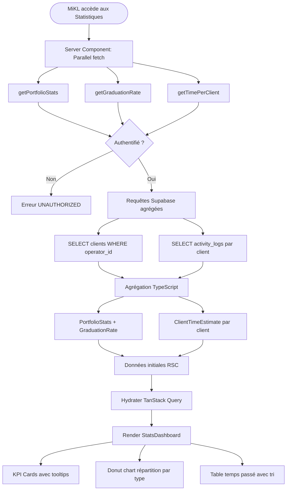

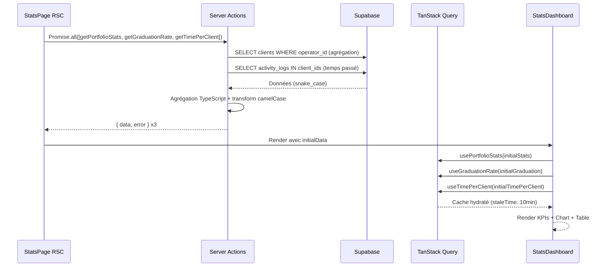

## Flux : Cycle de vie client — Suspendre / Clôturer / Réactiver

```mermaid
flowchart TD
    Start([MiKL ouvre fiche client]) --> CheckStatus{Statut actuel ?}

    CheckStatus -->|Actif| ShowActive[Header: boutons Suspendre + Clôturer]
    CheckStatus -->|Suspendu| ShowSuspended[Header: boutons Réactiver + Clôturer]
    CheckStatus -->|Clôturé| ShowArchived[Bandeau: bouton Réactiver + Mode lecture seule]

    ShowActive --> ActionChoice{Action choisie ?}
    ShowSuspended --> ActionChoice
    ShowArchived --> ActionReactivate

    ActionChoice -->|Suspendre| OpenSuspendDialog[Ouvrir SuspendClientDialog]
    ActionChoice -->|Clôturer| OpenCloseDialog[Ouvrir CloseClientDialog]
    ActionChoice -->|Réactiver| ActionReactivate[Clic Réactiver]

    OpenSuspendDialog --> FillReason[Optionnel: Saisir raison max 500 chars]
    FillReason --> ClickSuspend[Cliquer "Suspendre le client"]
    ClickSuspend --> SuspendAction[Server Action suspendClient]
    SuspendAction --> UpdateSuspend[UPDATE status=suspended, suspended_at=NOW]
    UpdateSuspend --> LogSuspend[INSERT activity_logs action=client_suspended]
    LogSuspend --> InvalidateSuspend[Invalider caches TanStack Query]
    InvalidateSuspend --> ToastSuspend[Toast "Client suspendu"]
    ToastSuspend --> CloseSuspendDialog[Fermer dialog]
    CloseSuspendDialog --> RefreshPage[Rafraîchir fiche client]

    OpenCloseDialog --> ShowConsequences[Afficher conséquences + double validation]
    ShowConsequences --> TypeName[MiKL saisit nom du client]
    TypeName --> ValidateName{Nom correspond ?}

    ValidateName -->|Non| DisableButton[Bouton "Clôturer définitivement" désactivé]
    ValidateName -->|Case-insensitive match| EnableButton[Bouton activé]

    EnableButton --> ClickClose[Cliquer "Clôturer définitivement"]
    ClickClose --> CloseAction[Server Action closeClient]
    CloseAction --> ServerValidate{Server valide nom ?}

    ServerValidate -->|Non| ErrorName[Erreur VALIDATION_ERROR]
    ServerValidate -->|Oui| UpdateClose[UPDATE status=archived, archived_at=NOW]

    UpdateClose --> LogClose[INSERT activity_logs action=client_closed]
    LogClose --> InvalidateClose[Invalider caches TanStack Query]
    InvalidateClose --> ToastClose[Toast "Client clôturé"]
    ToastClose --> CloseCloseDialog[Fermer dialog]
    CloseCloseDialog --> RefreshPage

    ActionReactivate --> ReactivateAction[Server Action reactivateClient]
    ReactivateAction --> UpdateReactivate[UPDATE status=active, suspended_at=null, archived_at=null]
    UpdateReactivate --> LogReactivate[INSERT activity_logs action=client_reactivated]
    LogReactivate --> InvalidateReactivate[Invalider caches TanStack Query]
    InvalidateReactivate --> ToastReactivate[Toast "Client réactivé"]
    ToastReactivate --> RefreshPage

    RefreshPage --> End([Fin])
    DisableButton --> TypeName
    ErrorName --> TypeName
```

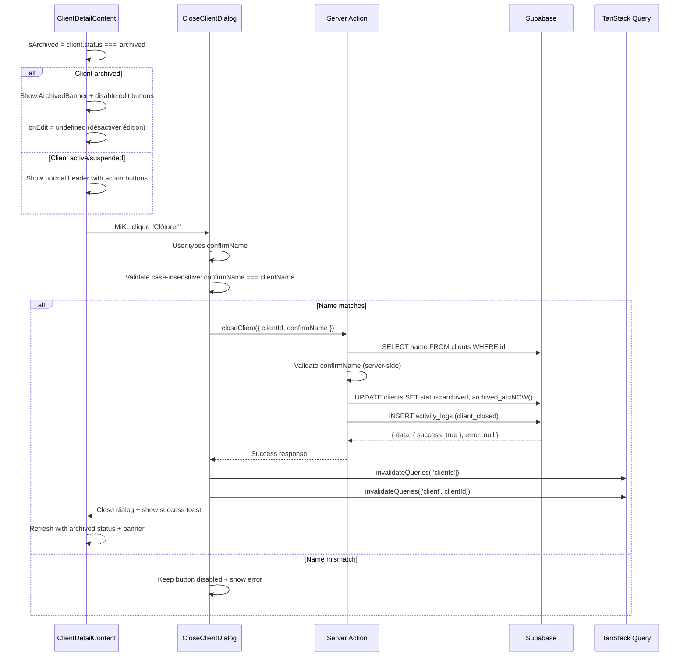

## Flux : Upgrade client Ponctuel vers Lab ou One

```mermaid
flowchart TD
    Start([MiKL ouvre fiche client Ponctuel actif]) --> ShowButtons[Header: boutons Upgrader vers Lab + Upgrader vers One]

    ShowButtons --> ClickLab[MiKL clique "Upgrader vers Lab"]
    ShowButtons --> ClickOne[MiKL clique "Upgrader vers One"]

    ClickLab --> OpenDialog[Ouvrir UpgradeClientDialog - onglet Lab]
    ClickOne --> OpenDialogOne[Ouvrir UpgradeClientDialog - onglet One]

    OpenDialog --> LoadTemplates[Charger templates via useParcourTemplates]
    LoadTemplates --> HasTemplates{Templates disponibles ?}

    HasTemplates -->|Non| EmptyState[Afficher "Aucun template de parcours"]
    HasTemplates -->|Oui| SelectTemplate[MiKL sélectionne un template]

    SelectTemplate --> ConfigStages[MiKL active/désactive les étapes]
    ConfigStages --> ClickUpgradeLab[Cliquer "Upgrader"]
    ClickUpgradeLab --> UpgradeActionLab[Server Action upgradeClient complet]

    UpgradeActionLab --> ValidateClient{client_type = ponctuel ?}
    ValidateClient -->|Non| ErrorNotPonctuel[Erreur VALIDATION_ERROR]
    ValidateClient -->|Oui| UpdateClientTypeLab[UPDATE clients.client_type = complet]
    UpdateClientTypeLab --> InsertParcours[INSERT parcours avec étapes]
    InsertParcours --> UpdateConfigLab[UPDATE client_configs dashboard_type=lab]
    UpdateConfigLab --> LogUpgradeLab[INSERT activity_logs action=client_upgraded]
    LogUpgradeLab --> InvalidateLab[Invalider caches TanStack Query]
    InvalidateLab --> ToastLab[Toast "Client upgradé vers Lab"]
    ToastLab --> CloseDialogLab[Fermer dialog]

    OpenDialogOne --> ShowModules[Afficher liste modules activables]
    ShowModules --> SelectModules[MiKL sélectionne modules optionnels]
    SelectModules --> ClickUpgradeOne[Cliquer "Upgrader"]
    ClickUpgradeOne --> UpgradeActionOne[Server Action upgradeClient direct_one]

    UpgradeActionOne --> ValidateClientOne{client_type = ponctuel ?}
    ValidateClientOne -->|Non| ErrorNotPonctuelOne[Erreur VALIDATION_ERROR]
    ValidateClientOne -->|Oui| UpdateClientTypeOne[UPDATE clients.client_type = direct_one]
    UpdateClientTypeOne --> UpdateConfigOne[UPDATE client_configs dashboard_type=one, active_modules]
    UpdateConfigOne --> LogUpgradeOne[INSERT activity_logs action=client_upgraded]
    LogUpgradeOne --> InvalidateOne[Invalider caches TanStack Query]
    InvalidateOne --> ToastOne[Toast "Client upgradé vers One"]
    ToastOne --> CloseDialogOne[Fermer dialog]

    CloseDialogLab --> End([Fin])
    CloseDialogOne --> End
```

## Flux : Détection inactivité Lab (Edge Function cron)

```mermaid
flowchart TD
    Start([pg_cron — 8h quotidien]) --> InvokeEdge[Appel Edge Function check-inactivity]
    InvokeEdge --> LoadOperators[Charger tous les opérateurs + threshold]

    LoadOperators --> ForEachOp[Pour chaque opérateur]
    ForEachOp --> CalcCutoff[Calculer date cutoff = NOW - threshold_days]
    CalcCutoff --> RPC[RPC get_inactive_lab_clients]

    RPC --> HasInactive{Clients inactifs trouvés ?}
    HasInactive -->|Non| NextOp[Opérateur suivant]
    HasInactive -->|Oui| ForEachClient[Pour chaque client inactif]

    ForEachClient --> CreateNotif[INSERT notification inactivity_alert]
    CreateNotif --> SetFlag[UPDATE client_configs inactivity_alert_sent = true]
    SetFlag --> NextClient[Client suivant]
    NextClient --> ForEachClient

    NextOp --> ForEachOp
    ForEachClient -->|Tous traités| NextOp

    NextOp -->|Tous traités| Response[Retourner { success: true }]
    Response --> End([Fin])
```

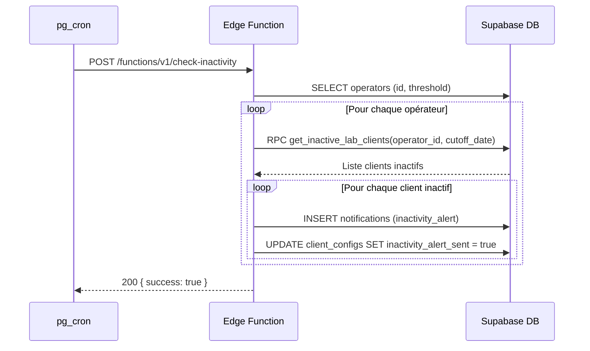

## Flux : Reset automatique du flag d'inactivité

```mermaid
flowchart LR
    Activity[Nouvelle activité client] --> Trigger[Trigger fn_reset_inactivity_alert]
    Trigger --> CheckFlag{inactivity_alert_sent = true ?}
    CheckFlag -->|Oui| ResetFlag[UPDATE client_configs SET inactivity_alert_sent = false]
    CheckFlag -->|Non| NoOp[Rien à faire]
```

## Flux : Import CSV — Upload, validation et exécution

```mermaid
flowchart TD
    Start([MiKL clique "Import CSV"]) --> OpenDialog[Ouvrir ImportCsvDialog]
    OpenDialog --> ShowUpload[Étape 1 : Upload]

    ShowUpload --> DownloadTemplate[Optionnel : Télécharger template CSV]
    ShowUpload --> SelectFile[MiKL sélectionne un fichier .csv]

    SelectFile --> ParseCSV[parseCsv côté client]
    ParseCSV --> ValidateRows[validateCsvRows — email, champs requis, types]
    ValidateRows --> ShowPreview[Étape 2 : Aperçu tableau]

    ShowPreview --> ColoredRows[Lignes vertes = valides, rouges = erreurs]
    ColoredRows --> ExcludeRows[MiKL peut exclure des lignes via checkbox]
    ExcludeRows --> ClickImport[Cliquer "Importer X clients"]

    ClickImport --> ServerAction[Server Action importClientsCsv]
    ServerAction --> AuthCheck{Authentifié ?}
    AuthCheck -->|Non| ErrorAuth[Erreur UNAUTHORIZED]
    AuthCheck -->|Oui| ZodValidation{Validation Zod ?}

    ZodValidation -->|Erreur| ErrorValidation[Erreur VALIDATION_ERROR]
    ZodValidation -->|OK| CheckEmails[Batch query emails existants]

    CheckEmails --> FilterDuplicates[Exclure emails déjà en base]
    FilterDuplicates --> HasValid{Lignes valides restantes ?}

    HasValid -->|Non| AllIgnored[Retourner importedCount: 0]
    HasValid -->|Oui| BatchInsert[INSERT batch clients]

    BatchInsert --> InsertConfigs[INSERT batch client_configs]
    InsertConfigs --> LogActivity[INSERT activity_logs action=csv_import]
    LogActivity --> Revalidate[revalidatePath /modules/crm]
    Revalidate --> ShowResult[Étape 3 : Résumé]

    ShowResult --> ResultSummary[X importés, Y ignorés]
    ResultSummary --> CloseDialog[Fermer dialog]
    CloseDialog --> End([Fin])
```

```mermaid
sequenceDiagram
    participant UI as ImportCsvDialog
    participant Parser as csv-parser (client)
    participant Validator as csv-validator (client)
    participant TQ as TanStack Query
    participant SA as Server Action
    participant SB as Supabase

    UI->>UI: MiKL sélectionne fichier CSV
    UI->>Parser: parseCsv(fileContent)
    Parser-->>UI: CsvImportRow[]

    UI->>Validator: validateCsvRows(rows)
    Validator-->>UI: CsvValidationResult[] (valid/errors)

    UI->>UI: Afficher aperçu coloré
    UI->>UI: MiKL exclut lignes optionnelles
    UI->>UI: MiKL clique "Importer"

    UI->>TQ: useImportCsv.mutate(validRows)
    TQ->>SA: importClientsCsv({ rows })
    SA->>SB: SELECT emails déjà existants (batch IN)
    SB-->>SA: Emails existants

    SA->>SA: Filtrer lignes avec emails dupliqués
    SA->>SB: INSERT batch clients
    SB-->>SA: Clients insérés avec IDs

    SA->>SB: INSERT batch client_configs
    SA->>SB: INSERT activity_logs (csv_import)
    SA-->>TQ: { data: { importedCount, ignoredCount }, error: null }

    TQ->>TQ: invalidateQueries(['clients'])
    TQ-->>UI: Afficher résumé
```

## Notes

- La recherche utilise un debounce de 300ms pour éviter les requêtes excessives
- Le seuil de 500 clients détermine si le filtrage est client-side ou server-side
- RLS garantit l'isolation des données même si le front-end est compromis
- TanStack Query met en cache les résultats pour améliorer les performances
- Les onglets utilisent le lazy-loading : les données ne sont fetchées qu'au premier clic
- L'onglet actif est synchronisé avec l'URL query param pour le partage de liens
- La clôture nécessite une double validation (saisie nom client) pour éviter les erreurs
- Les clients archivés sont exclus par défaut de la liste (filtre "Clôturés" disponible)
- La réactivation (suspendu/archivé → actif) est immédiate sans confirmation
- L'Edge Function d'inactivité utilise la `service_role_key` pour bypasser le RLS
- Le flag `inactivity_alert_sent` est auto-reset par un trigger PostgreSQL sur `activity_logs`
- Le parsing CSV est 100% côté client (pas de round-trip serveur pour l'aperçu)
- L'import CSV utilise un batch insert (pas d'insertion ligne par ligne)
